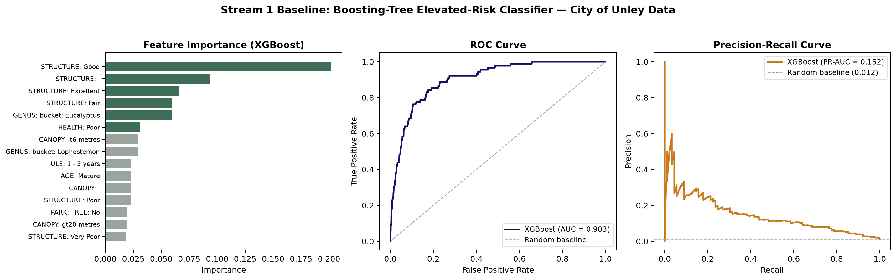
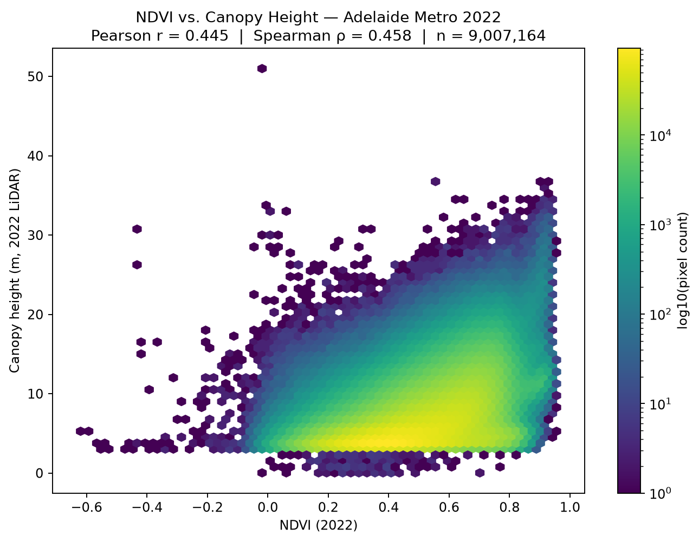
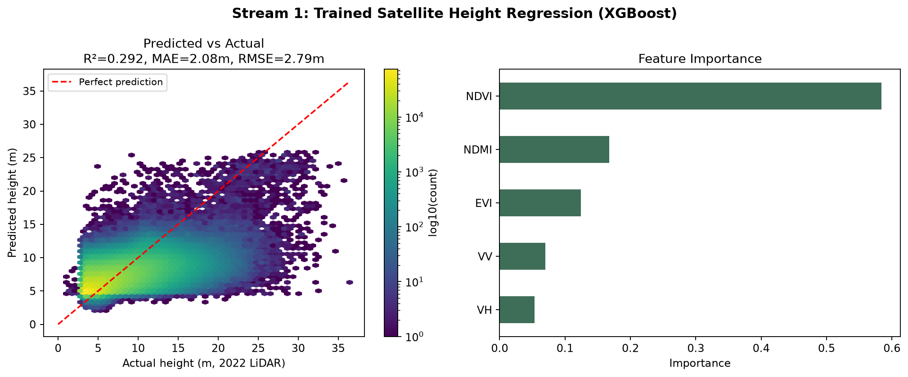
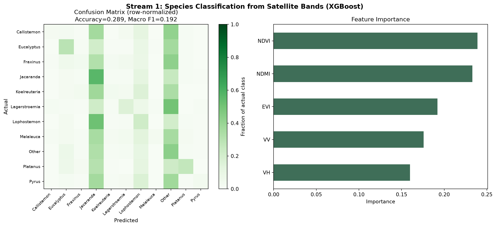

# Stream 1 — Vegetation–Network Risk Modelling
**Project pg-s2-20 | Vegetation Modelling for Risk Assessment and Outage Reduction**

Stream 1 builds a probabilistic, risk-ranking model of vegetation-related outage risk using statistical/ML techniques — vegetation proximity and condition, environmental covariates, and historic outage data. This README documents everything built and validated so far, with results.

**Modelling approach:** gradient-boosted trees (XGBoost) throughout — not Random Forest or SVM — per direct guidance from the Industry Supervisor, who described boosting trees as the more current generation of tree-based methods with better performance.

---

## 1. Boosting-Tree Risk Classifier (City of Unley baseline)

**Script:** `scripts/01_unley_risk_classifier/train_and_visualize.py`

**Why:** Ahead of real-world outage data becoming available, we needed to validate the full modelling pipeline — data → features → boosting trees → evaluation → interpretable output — end to end on real data, so the team isn't starting from zero once it arrives.

**Data:** City of Unley's open street-tree dataset (opendata.unley.sa.gov.au) — 30,881 real trees, filtered to 30,040 with a valid council risk rating.

**Method:** Predicted "Elevated Risk" (Unley's Moderate + High risk categories combined) vs. "Low" from structural/species attributes. Only **1.18% of trees are labelled elevated risk** — severe class imbalance, handled explicitly via `scale_pos_weight` rather than ignored.


*Feature importance, ROC curve, and precision-recall curve for the Unley risk classifier.*

| Metric | Value |
|---|---|
| ROC-AUC | 0.903 |
| PR-AUC | 0.152 (12.8× lift over the 0.0119 random baseline at this class balance) |
| Recall (Elevated) | 0.78 |
| Precision (Elevated) | 0.07 |

Top features: structural condition, species genus (Eucalyptus, Lophostemon), health status, canopy size — all human-interpretable, not black-box signals.

**Honest caveat:** this predicts Unley council's own *arboricultural* risk rating (structural/health condition), **not** real-world outage risk — that label isn't available yet. This validates the pipeline architecture; the target variable gets swapped once real outage data arrives.

---

## 2. NDVI vs. 2022 LiDAR Canopy Height Correlation

**Scripts:** `scripts/03_satellite_regression/get_ndvi_2022.py`, `correlate_ndvi_height.py`

**Why:** Direct supervisor suggestion — check whether NDVI correlates with the 2022 LiDAR-derived canopy height data, since both are publicly accessible, making this fully unblocked ahead of any further data release.


*NDVI vs. canopy height across 9,007,164 real pixel pairs, full metro Adelaide, 2022.*

| Metric | Value |
|---|---|
| Pearson r | 0.445 |
| Spearman ρ | 0.458 |
| Valid paired pixels | 9,007,164 |

**Finding:** real, statistically robust correlation, but the relationship **saturates** at higher NDVI values — NDVI measures greenness, not physical structure, so it can't tell a 15m tree from a 30m tree. This directly motivated adding a structural signal (SAR) in the next stage.

---

## 3. Trained Satellite Height Regression

**Scripts:** `scripts/03_satellite_regression/get_multiband_2022.py`, `train_height_regression.py`

**Why:** This is Stream 1's core "Trained Satellite Regression" deliverable — train once on real 2022 LiDAR ground truth, then apply to fresh satellite imagery without needing repeat LiDAR surveys.

**Features:** NDVI, EVI, NDMI (Sentinel-2 optical) + VV, VH (Sentinel-1 SAR, added to address NDVI's saturation at high canopy heights).


*Predicted vs. actual height and feature importance, full metro Adelaide, validated at scale (2,251,769 held-out pixels).*

| | Pilot (small area) | Full metro Adelaide |
|---|---|---|
| R² | 0.300 | 0.292 |
| MAE | 1.77 m | 2.08 m |
| RMSE | 2.52 m | 2.79 m |

**Feature importance (full metro):** NDVI 58%, NDMI 17%, EVI 12%, VV 7%, VH 5%.

**Key findings:**
- Result consistent between a small pilot and the full metro area — a stable finding, not a fluke of sample size.
- **SAR contributed less than expected** (~12% combined) — a single yearly-median SAR composite doesn't appear to resolve the NDVI saturation problem it was added to address. Likely needs seasonal splitting or texture-based features (not yet attempted).
- The model **systematically under-predicts tall trees** (20m+), the direct downstream consequence of NDVI saturation.
- For risk-banding purposes (short/medium/tall), ~2m average error is likely usable even with this limitation.

---

## 4. Species Classification — Initial Attempt

**Scripts:** `scripts/04_species_classification/extract_species_points.py`, `train_species_classifier.py`

**Why:** Stream 1's design calls for height *and* species output. Used real Unley tree records (species + exact coordinates) as ground truth, sampling the same satellite feature stack at each tree's location.


*Confusion matrix and feature importance for genus classification from satellite bands.*

| Metric | Value |
|---|---|
| Accuracy | 0.289 |
| Macro F1 | 0.192 (the more honest metric here) |
| Naive baseline (always guess most common genus) | ~0.21 |

**Honest result: this performed weakly.** The model can distinguish two spectrally distinctive genera (Eucalyptus, Jacaranda) but defaults to a guess for the rest. Most likely cause: individual street-tree canopies are often smaller than a single Sentinel-2 pixel (10m), so each pixel blends the tree with surrounding footpath/road/grass — a resolution limit, not a modelling error.

**Next steps identified:** add height (from Section 3's model) as an input feature; and/or reframe the target as broader functional groups rather than precise genus; and/or pull multi-season NDVI to capture phenology instead of one yearly average.

---

## Status Summary

| Task | Status |
|---|---|
| Risk classifier (Unley baseline) | ✅ Done — ROC-AUC 0.903 |
| NDVI/LiDAR correlation | ✅ Done — validated at full metro scale |
| Height regression | ✅ Done — R²=0.292, validated at scale |
| Species classification | ✅ Done (initial) — weak result, next steps documented |
| SAR improvement (seasonal/texture features) | ⬜ Not started |
| Combined height+species risk output | ⬜ Not started |
| Validation against real outage data | 🚧 Blocked — pending data release |

---

## Setup

```bash
pip install -r requirements.txt
```

Google Earth Engine additionally requires a one-time free account + Cloud project registration — see comments in `get_ndvi_2022.py` for the full setup sequence.

## Key Data Sources

- City of Unley Street Trees — opendata.unley.sa.gov.au/datasets/street-trees
- Adelaide Metro Urban Canopy Height 2022 — SA DEW / Green Adelaide, data.sa.gov.au
- Sentinel-1 (SAR) / Sentinel-2 (optical) — via Google Earth Engine

## Supervisor Guidance Incorporated

- Boosting trees (XGBoost), not Random Forest or SVM
- NDVI/LiDAR correlation as an unblocked validation step
- Vegetation and network/asset data kept modular, not fused prematurely
